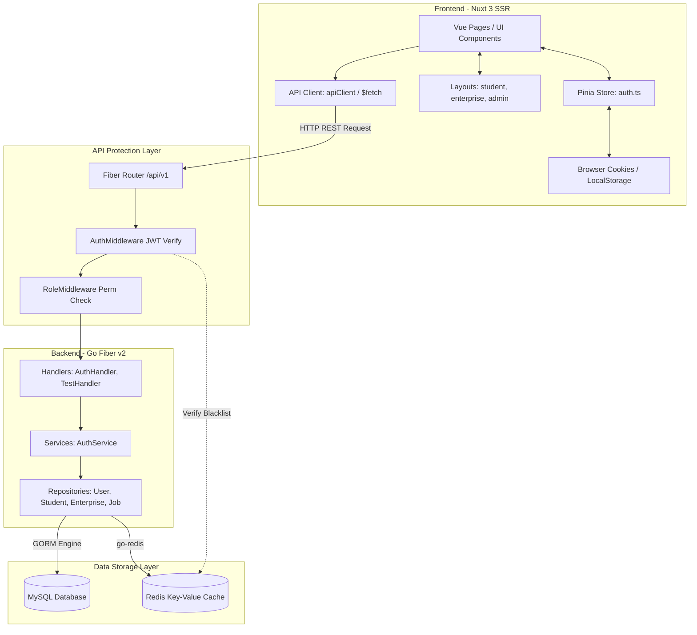
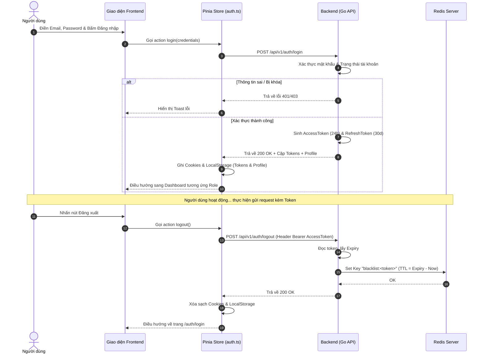
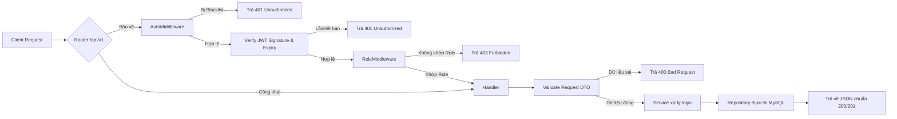
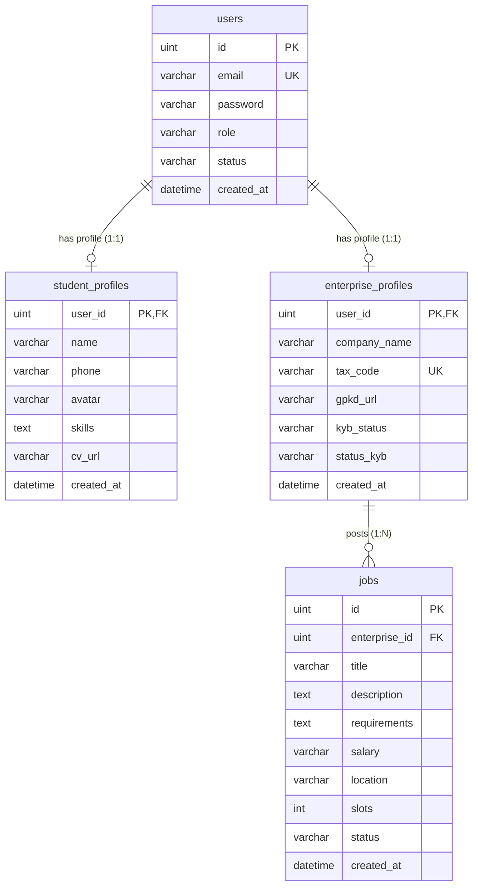

# TÀI LIỆU TỔNG QUAN DỰ ÁN QUICKWORK

Tài liệu này cung cấp cái nhìn toàn diện về kiến trúc, cấu trúc thư mục, luồng xử lý dữ liệu, thiết kế cơ sở dữ liệu và hướng dẫn vận hành dự án **QuickWork** dành cho lập trình viên phát triển hệ thống.

---

## MỤC LỤC
1. [Tổng quan dự án](#1-tổng-quan-dự-án)
2. [Cấu trúc thư mục](#2-cấu-trúc-thư-mục)
3. [Luồng chạy tổng quát](#3-luồng-chạy-tổng-quát)
4. [Luồng Authentication](#4-luồng-authentication)
5. [Luồng xử lý các phân hệ (Module Flows)](#5-luồng-xử-lý-các-phân-hệ-module-flows)
6. [Kiến trúc Backend](#6-kiến-trúc-backend)
7. [Kiến trúc Frontend](#7-kiến-trúc-frontend)
8. [Luồng dữ liệu mẫu (Data Flow Example)](#8-luồng-dữ-liệu-mẫu-data-flow-example)
9. [Cơ sở dữ liệu (Database Schema & Relations)](#9-cơ-sở-dữ-liệu-database-schema--relations)
10. [Danh sách API (API Specifications)](#10-danh-sách-api-api-specifications)
11. [Hướng dẫn chạy dự án](#11-hướng-dẫn-chạy-dự-án)
12. [Quy trình phát triển tính năng mới](#12-quy-trình-phát-triển-tính-năng-mới)
13. [Các điểm cần lưu ý & Quy tắc viết code](#13-các-điểm-cần-lưu-ý--quy-tắc-viết-code)
14. [Hệ thống sơ đồ Mermaid](#14-hệ-thống-sơ-đồ-mermaid)

---

## 1. TỔNG QUAN DỰ ÁN

*   **Tên dự án:** QuickWork
*   **Mục đích dự án:** Xây dựng nền tảng kết nối, giới thiệu việc làm bán thời gian/ngắn hạn và quản lý cơ hội ứng tuyển tối ưu cho Sinh viên và Doanh nghiệp.
*   **Bài toán giải quyết:**
    *   **Sinh viên (Student):** Dễ dàng tìm kiếm các công việc part-time uy tín, ứng tuyển nhanh chóng thông qua CV trực tuyến, quản lý ví cá nhân (wallet) và check-in/out công việc hàng ngày.
    *   **Doanh nghiệp (Enterprise):** Đăng tuyển việc làm, tiếp cận nguồn nhân lực sinh viên dồi dào, thực hiện xác thực thông tin doanh nghiệp (KYB) để nâng cao độ tin cậy.
    *   **Quản trị viên (Admin):** Quản lý hệ thống, duyệt trạng thái KYB của doanh nghiệp, quản lý các danh mục công việc, xử lý phản hồi và xem báo cáo phân tích.
*   **Đối tượng sử dụng:** Sinh viên (Role: `STUDENT`), Doanh nghiệp (Role: `ENTERPRISE`), Quản trị viên (Role: `ADMIN`).
*   **Công nghệ sử dụng:**
    *   **Backend:** Go (v1.26.2), Fiber v2 framework, GORM ORM, Swagger API Docs.
    *   **Frontend:** Nuxt 3 (chạy chế độ SSR = true, tương thích compatibility version 4), Vue 3, Pinia (State Management), TailwindCSS.
    *   **Database:** MySQL (lưu trữ chính).
    *   **Cache & Session Key Store:** Redis (sử dụng làm cơ chế lưu trữ Token Blacklist khi người dùng Đăng xuất để vô hiệu hóa JWT).
*   **Kiến trúc tổng thể:** Decoupled Client-Server. Giao tiếp hoàn toàn qua RESTful APIs, xác thực stateless thông qua JWT Token (Access Token và Refresh Token).

---

## 2. CẤU TRÚC THƯ MỤC

Dự án được chia thành 2 thư mục chính nằm ở thư mục gốc: `backend/` và `frontend/`.

### 2.1 Cấu trúc thư mục Backend
```text
backend/
├── cmd/
│   └── api/
│       └── main.go         # Điểm khởi chạy ứng dụng (Entrypoint)
├── config/
│   └── config.go       # Nạp biến môi trường từ file .env vào struct Config
├── database/
│   ├── migration.go    # Tự động đồng bộ schema database (AutoMigrate)
│   ├── mysql.go        # Cấu hình kết nối GORM MySQL
│   ├── redis.go        # Khởi tạo kết nối Redis (không sử dụng trực tiếp trong main)
│   └── seed.go         # Dữ liệu mẫu ban đầu (chưa hoàn thiện)
├── docs/               # Chứa các file Swagger docs tự sinh
├── internal/           # Mã nguồn logic cốt lõi của dự án
│   ├── dto/            # Data Transfer Objects
│   │   ├── request/    # Cấu trúc dữ liệu nhận từ Client + Validation tag
│   │   └── response/   # Cấu trúc dữ liệu trả về cho Client
│   ├── handlers/       # Tầng điều hướng (Controller), nhận HTTP request, gọi Service
│   ├── middlewares/    # Middleware xử lý Auth và phân quyền Role
│   ├── models/         # Thực thể Database (GORM Models)
│   ├── repositories/   # Tầng thao tác trực tiếp với Database (MySQL & Redis)
│   └── services/       # Tầng logic nghiệp vụ chính (Business Logic)
├── pkg/                # Các thư viện và công cụ tiện ích dùng chung
│   ├── jwt/            # Tạo, xác thực và giải mã JWT Token
│   ├── logger/         # Hỗ trợ ghi log hệ thống
│   ├── pagination/     # Tiện ích phân trang dữ liệu
│   ├── password/       # Băm mật khẩu (bcrypt)
│   ├── redis/          # Quản lý kết nối Redis dùng chung cho blacklist
│   ├── response/       # Định dạng Response chuẩn của hệ thống
│   ├── upload/         # Logic tải lên tệp tin
│   └── validator/      # Hỗ trợ tùy biến validate
├── routes/             # Định nghĩa các endpoint và gắn middleware
└── uploads/            # Thư mục lưu trữ file tĩnh tải lên (như GPKD)
```

### 2.2 Cấu trúc thư mục Frontend
```text
frontend/
├── app/
│   ├── assets/         # Chứa hình ảnh, stylesheet (css, scss)
│   ├── components/     # UI Components dùng chung (Button, Input, Modal, Toast...)
│   │   └── ui/         # Các base UI component thiết kế sẵn theo Tailwind
│   ├── composables/    # Các Vue Composables (như useToast.ts)
│   ├── constants/      # Định nghĩa hằng số hệ thống
│   ├── layouts/        # Layout của từng nhóm đối tượng (default, auth, student, enterprise, admin)
│   ├── middleware/     # Route Middleware điều hướng ở client (như auth.global.ts)
│   ├── pages/          # Các trang giao diện (Routing tự động dựa trên thư mục)
│   │   ├── admin/      # Các trang quản trị dành cho ADMIN
│   │   ├── auth/       # Các trang Đăng ký, Đăng nhập, Callback Google
│   │   ├── enterprise/ # Trang tổng quan dành cho ENTERPRISE
│   │   └── student/    # Các trang dành cho STUDENT
│   ├── plugins/        # Nuxt Plugins (như api.ts cung cấp $api client)
│   ├── services/       # Tầng kết nối API (gọi axios/fetch lên Backend)
│   ├── stores/         # Quản lý State bằng Pinia (auth.ts)
│   ├── types/          # Định nghĩa kiểu dữ liệu TypeScript
│   └── utils/          # Các hàm tiện ích bổ trợ
├── public/             # File tĩnh phục vụ trình duyệt
├── nuxt.config.ts      # Cấu hình Nuxt 3
└── tsconfig.json       # Cấu hình TypeScript compiler
```

---

## 3. LUỒNG CHẠY TỔNG QUÁT

Khi người dùng thực hiện một hành động trên giao diện (ví dụ: nhấn nút gửi Form Đăng nhập):

```text
Người dùng (UI)
     ↓ (1. Nhấp chuột / Nhập liệu)
Nuxt Page (Frontend)
     ↓ (2. Gọi API Service thông qua apiClient)
RESTful API Request (HTTP POST/GET)
     ↓ (3. Đi qua Routing & Middleware xác thực JWT / Blacklist trên Backend)
Middlewares (AuthMiddleware, RoleMiddleware)
     ↓ (4. Chuyển tiếp nếu hợp lệ)
Handler (Controller)
     ↓ (5. Trích xuất request body, Validate định dạng bằng struct tags)
Service (Business Logic)
     ↓ (6. Thực hiện nghiệp vụ, kiểm tra ràng buộc, quản lý DB Transaction)
Repository (Database Access)
     ↓ (7. Thực thi truy vấn)
Database (MySQL / Redis)
     ↓ (8. Trả dữ liệu thực thể)
Repository
     ↓ (9. Trả kết quả)
Service
     ↓ (10. Đóng gói kết quả thành Response DTO)
Handler
     ↓ (11. Định dạng JSON Response chuẩn: success, message, data)
HTTP Response
     ↓ (12. Nhận dữ liệu, cập nhật State Pinia / Cookie)
Frontend Page (UI)
     ↓ (13. Render giao diện và hiển thị Toast thông báo thành công/thất bại)
Người dùng
```

---

## 4. LUỒNG AUTHENTICATION

Hệ thống QuickWork sử dụng cơ chế xác thực **Stateless JWT** kết hợp **Redis Token Blacklist** để thu hồi token khi logout.

### 4.1 Quy trình Đăng ký (Register)
*   **Sinh viên (Student):** Gửi Email, Password, Name, Phone. Hệ thống băm mật khẩu bằng `bcrypt`, sử dụng database transaction để tạo bản ghi trong bảng `users` (Role: `STUDENT`, Status: `ACTIVE`) và `student_profiles` liên kết bằng `user_id`.
*   **Doanh nghiệp (Enterprise):** Gửi Email, Password, CompanyName, TaxCode, GPKDURL. Hệ thống băm mật khẩu, sử dụng transaction tạo bản ghi trong bảng `users` (Role: `ENTERPRISE`, Status: `ACTIVE`) và `enterprise_profiles` (KYBStatus: `PENDING`, StatusKYB: `PENDING`). Doanh nghiệp cần được Admin duyệt trạng thái KYB sang `APPROVED` thì mới có quyền hoạt động đầy đủ.

### 4.2 Quy trình Đăng nhập (Login)
*   Người dùng gửi thông tin Đăng nhập (Email, Password).
*   Backend xác thực tài khoản:
    1.  Tìm user theo Email.
    2.  So sánh mật khẩu đã hash.
    3.  Kiểm tra trạng thái User (phải là `ACTIVE`).
    4.  Nếu hợp lệ, sinh cặp mã Token:
        *   **Access Token:** Hết hạn sau **24 giờ**, chứa `user_id`, `role`, `token_uuid`. Ký bằng thuật toán HS256 với `JWT_SECRET`.
        *   **Refresh Token:** Hết hạn sau **30 ngày**, chứa `user_id`, `role`, `token_uuid`.
*   Frontend nhận về Tokens, lưu `access_token` vào Cookie + LocalStorage, lưu `refresh_token` vào Cookie để sử dụng cho các request sau.

### 4.3 Quy trình Đăng nhập qua Google OAuth
*   Client chuyển hướng người dùng sang trang Google Auth -> Nhận về `code` xác thực.
*   Client gửi `code` lên `/auth/google`.
*   Backend nhận code và trao đổi với Google Server để lấy `email`, `name`, `picture`.
    *   *Nếu email chưa tồn tại trong hệ thống:* Tự động tạo tài khoản với Role `STUDENT` và trạng thái `ACTIVE` (password được sinh ngẫu nhiên dạng UUID). Đồng thời tạo `student_profiles` với thông tin lấy từ Google.
    *   *Nếu email đã tồn tại:* Kiểm tra trạng thái tài khoản. Cập nhật Avatar/Name nếu trước đó trống.
*   Backend sinh Access Token và Refresh Token trả về cho Client.

### 4.4 Quy trình Đăng xuất & Redis Blacklist
Khi người dùng bấm Đăng xuất:
1.  Client gửi yêu cầu `POST /auth/logout` kèm Access Token ở header `Authorization` và Refresh Token ở cookie.
2.  Backend tiếp nhận:
    *   Trích xuất Access Token và Refresh Token.
    *   Giải mã token không kiểm tra chữ ký (Decode without validation) để lấy thời gian hết hạn (`ExpiresAt`).
    *   Tính toán thời gian sống còn lại (`TTL = ExpiresAt - Thời gian hiện tại`).
    *   Nếu `TTL > 0`, lưu token đó vào Redis với Key: `blacklist:<token>` và đặt thời gian hết hạn của Key bằng chính `TTL`.
3.  Client xóa toàn bộ Cookie và LocalStorage rồi điều hướng về trang `/auth/login`.
4.  **Kiểm tra Blacklist:** Bất kỳ request nào gửi lên các API được bảo vệ bởi `AuthMiddleware` đều phải đi qua bước kiểm tra Redis. Nếu key `blacklist:<token>` tồn tại trong Redis, middleware trả về ngay lập tức lỗi `401 Unauthorized` ("Invalid Token"), chặn đứng các request dùng token cũ.

---

## 5. LUỒNG XỬ LÝ CÁC PHÂN HỆ (MODULE FLOWS)

Dự án hiện tại tập trung cốt lõi vào phân hệ **Xác thực & Quản lý Tài khoản (Auth)**. Các phân hệ khác đang ở giai đoạn khung sườn (skeleton) ở Backend hoặc dạng Mock dữ liệu ở Frontend.

### 5.1 Phân hệ Auth (Authentication & Account)
*   **Chức năng:** Đăng ký Sinh viên, Đăng ký Doanh nghiệp, Đăng nhập thường, Đăng nhập Google, Đăng xuất, Tải lên Giấy phép kinh doanh (GPKD), Tạo tài khoản Admin đầu tiên.
*   **API chính:** Xem chi tiết tại [Mục 10 (Danh sách API)](#10-danh-sách-api-api-specifications).
*   **Luồng xử lý Đăng ký Doanh nghiệp:**
    ```text
    Client gửi JSON -> AuthHandler.RegisterEnterprise 
                           ↓ (Validate dữ liệu: Email, Password, TaxCode...)
                     AuthService.RegisterEnterprise
                           ↓ (Check email/taxcode trùng lặp trong DB)
                     DB Transaction (Begin)
                           ↓ (Tạo User -> Tạo EnterpriseProfile với trạng thái KYB PENDING)
                     DB Transaction (Commit)
                           ↓
                     Trả về RegisterResponse (201 Created)
    ```
*   **Services liên quan:** `AuthService` ([auth_service.go](file:///d:/GOLANG/QuickWork/backend/internal/services/auth_service.go)).
*   **Repositories liên quan:**
    *   `UserRepository` ([user_repository.go](file:///d:/GOLANG/QuickWork/backend/internal/repositories/user_repository.go))
    *   `StudentRepository` ([student_repository.go](file:///d:/GOLANG/QuickWork/backend/internal/repositories/student_repository.go))
    *   `EnterpriseRepository` ([enterprise_repository.go](file:///d:/GOLANG/QuickWork/backend/internal/repositories/enterprise_repository.go))
    *   `AuthRedisRepository` ([auth_redis_repository.go](file:///d:/GOLANG/QuickWork/backend/internal/repositories/auth_redis_repository.go))
*   **Models liên quan:** `User`, `StudentProfile`, `EnterpriseProfile`.

### 5.2 Phân hệ Job (Việc làm - Giai đoạn Sơ khai)
*   **Chức năng:** Phía backend đã thiết kế Database Model `Job` và các phương thức truy vấn cơ bản trong `JobRepository` nhưng **chưa cài đặt logic điều phối trong Service và chưa map API route**.
*   **Models liên quan:** `Job` ([job.go](file:///d:/GOLANG/QuickWork/backend/internal/models/job.go)).
*   **Repositories liên quan:** `JobRepository` ([job_repository.go](file:///d:/GOLANG/QuickWork/backend/internal/repositories/job_repository.go)) cung cấp các hàm:
    *   `Create(job *models.Job) error`
    *   `Update(job *models.Job) error`
    *   `FindByID(id uint) (*models.Job, error)`
    *   `FindByEnterprise(enterpriseID uint, status string) ([]models.Job, error)`
*   **Trạng thái nghiệp vụ Job:** `DRAFT`, `PENDING`, `APPROVED`, `REJECTED`, `CLOSED`.

---

## 6. KIẾN TRÚC BACKEND

Backend được xây dựng theo kiến trúc nhiều tầng (Layered Architecture) giúp phân tách rõ ràng trách nhiệm của từng phần code.

| Tầng | Vai trò & Trách nhiệm | File minh họa |
| :--- | :--- | :--- |
| **Router** | Định nghĩa các endpoint, nhóm các route và gắn Middleware kiểm soát tương ứng. | [routes/auth.go](file:///d:/GOLANG/QuickWork/backend/routes/auth.go) |
| **Middleware** | Can thiệp trước khi request tới Handler. Dùng để xác thực JWT Token, phân quyền Role, và kiểm tra Token blacklist trên Redis. | [middlewares/auth_middleware.go](file:///d:/GOLANG/QuickWork/backend/internal/middlewares/auth_middleware.go) |
| **Handler** | Tiếp nhận request từ Router, phân tích dữ liệu body/params đầu vào, chuyển tiếp dữ liệu đến Service và đóng gói JSON trả về cho Client. | [handlers/auth_handler.go](file:///d:/GOLANG/QuickWork/backend/internal/handlers/auth_handler.go) |
| **DTO / Validator** | Định nghĩa khuôn mẫu dữ liệu đầu vào/ra. Sử dụng thư viện `validator/v10` thông qua các struct tag để kiểm tra tính hợp lệ của dữ liệu (email, số điện thoại, độ dài...). | [dto/request/login_request.go](file:///d:/GOLANG/QuickWork/backend/internal/dto/request/login_request.go) |
| **Service** | Xử lý logic nghiệp vụ chính của hệ thống. Đây là nơi duy nhất quản lý các DB Transaction để đảm bảo tính toàn vẹn dữ liệu. | [services/auth_service.go](file:///d:/GOLANG/QuickWork/backend/internal/services/auth_service.go) |
| **Repository** | Đóng gói tất cả các thao tác đọc ghi với MySQL (qua GORM) hoặc Redis. Service sẽ gọi Repository chứ không gọi trực tiếp DB Driver. | [repositories/user_repository.go](file:///d:/GOLANG/QuickWork/backend/internal/repositories/user_repository.go) |
| **Entity / Model** | Định nghĩa cấu trúc các bảng trong Database MySQL bằng Go struct, thiết lập các ràng buộc GORM (khóa ngoại, index, kiểu dữ liệu cột). | [models/user.go](file:///d:/GOLANG/QuickWork/backend/internal/models/user.go) |
| **Database Connection**| Quản lý kết nối, thiết lập Connection Pool (Max Idle Conns, Max Open Conns, Connection Max Lifetime) và thực hiện di cư dữ liệu (Migration). | [database/mysql.go](file:///d:/GOLANG/QuickWork/backend/database/mysql.go) |

---

## 7. KIẾN TRÚC FRONTEND

Frontend được tổ chức dựa trên kiến trúc của Nuxt 3 với các thành phần chính liên kết chặt chẽ với nhau:

*   **Pages (Trang):** Đảm nhiệm việc hiển thị giao diện của từng màn hình cụ thể. Routing được sinh tự động theo cấu trúc thư mục của `app/pages`.
*   **Layouts (Bố cục):** Định nghĩa cấu trúc khung của giao diện (ví dụ: Sidebar cho Admin/Doanh nghiệp, Navbar cho Sinh viên). Các trang sẽ được bọc trong các Layout phù hợp (`NuxtLayout`).
*   **Components (Thành phần):** Các khối giao diện nhỏ hơn có khả năng tái sử dụng cao. Được chia thành các component UI cơ bản (Button, Input, Modal, Toast) và các component nghiệp vụ (Jobs, Layout...).
*   **Composables (Hàm tiện ích Vue):** Đóng gói logic có trạng thái có thể tái sử dụng (ví dụ: `useToast.ts` quản lý việc đẩy thông báo lên màn hình).
*   **Stores (Pinia):** Nơi quản lý trạng thái tập trung toàn ứng dụng. Cụ thể có `auth.ts` lưu trữ trạng thái đăng nhập (`isAuthenticated`), thông tin người dùng (`user`) và token.
*   **Plugins (Tiện ích mở rộng):** Được tải trước khi khởi tạo ứng dụng. `plugins/api.ts` giúp cung cấp dịch vụ apiClient toàn cục.
*   **Middleware (Client Routing):** Nuxt Route Middleware (như `auth.global.ts`) chạy trước khi điều hướng trang để kiểm tra quyền truy cập của người dùng dựa vào trạng thái đăng nhập và Role lưu trong Pinia Store.
*   **API Layer (Services):** Các file định nghĩa hàm kết nối mạng gửi dữ liệu lên Backend thông qua một client fetch chuẩn hóa (`apiClient` thiết lập sẵn token trong Authorization header).

---

## 8. LUỒNG DỮ LIỆU MẪU (DATA FLOW EXAMPLE)

Ví dụ chi tiết về luồng hoạt động khi người dùng thực hiện Đăng nhập:

```text
[User] điền Email/Password -> Click nút Đăng nhập
                             ↓
[Page: auth/login.vue] bắt sự kiện submit -> Gọi hành động `authStore.login(credentials)`
                             ↓
[Pinia Store: auth.ts] thực thi Action `login` -> Gọi API `AuthService.login(credentials)`
                             ↓
[Service API: auth.service.ts] gọi `apiClient.post("/auth/login", payload)`
                             ↓
[Backend Handler: AuthHandler.Login] tiếp nhận, parse JSON, validate đầu vào hợp lệ
                             ↓
[Backend Service: AuthService.Login] kiểm tra DB, so sánh hash mật khẩu, kiểm tra trạng thái
                             ↓
[Backend Response] sinh Access Token (24h) + Refresh Token (30 ngày) -> Trả về JSON (200 OK)
                             ↓
[Pinia Store: auth.ts] nhận kết quả -> Lưu Access Token & Refresh Token vào Cookie
                                    -> Lưu User Profile vào LocalStorage & Cập nhật state `user`
                             ↓
[Nuxt Middleware: auth.global.ts] nhận diện trạng thái thay đổi -> Chuyển hướng sang trang Dashboard
                             ↓
[Page: student/index.vue] (hoặc enterprise) được render trên trình duyệt phù hợp với Role
```

---

## 9. CƠ SỞ DỮ LIỆU (DATABASE SCHEMA & RELATIONS)

Hệ thống cơ sở dữ liệu MySQL của QuickWork bao gồm 4 bảng chính được đồng bộ qua GORM:

### 9.1 Bảng `users` (Lưu trữ tài khoản)
*   **Ý nghĩa:** Quản lý tài khoản đăng nhập và phân quyền hệ thống.
*   **Các cột chính:**
    *   `id` (uint, Primary Key, Auto Increment)
    *   `email` (varchar(255), Unique Index, Not Null)
    *   `password` (varchar(255), Not Null - bị ẩn khi xuất JSON)
    *   `role` (enum('ADMIN', 'STUDENT', 'ENTERPRISE'), Default: 'STUDENT')
    *   `status` (enum('ACTIVE', 'INACTIVE', 'BANNED'), Default: 'ACTIVE')
    *   `created_at`, `updated_at`, `deleted_at`

### 9.2 Bảng `student_profiles` (Thông tin sinh viên)
*   **Ý nghĩa:** Lưu trữ thông tin cá nhân, kỹ năng và CV của sinh viên.
*   **Các cột chính:**
    *   `user_id` (uint, Primary Key) - Khóa ngoại liên kết 1-1 với `users.id` (OnUpdate: CASCADE, OnDelete: CASCADE)
    *   `name` (varchar(100), Not Null)
    *   `phone` (varchar(20))
    *   `avatar` (varchar(255))
    *   `skills` (text)
    *   `cv_url` (varchar(255))
    *   `created_at`, `updated_at`, `deleted_at`

### 9.3 Bảng `enterprise_profiles` (Thông tin doanh nghiệp)
*   **Ý nghĩa:** Lưu trữ thông tin doanh nghiệp và trạng thái kiểm duyệt pháp lý (KYB).
*   **Các cột chính:**
    *   `user_id` (uint, Primary Key) - Khóa ngoại liên kết 1-1 với `users.id` (OnUpdate: CASCADE, OnDelete: CASCADE)
    *   `company_name` (varchar(255), Not Null)
    *   `tax_code` (varchar(100), Unique Index)
    *   `gpkd_url` (varchar(255))
    *   `kyb_status` (varchar(20), Default: 'PENDING')
    *   `status_kyb` (enum('PENDING', 'APPROVED', 'REJECTED'), Default: 'PENDING')
    *   `created_at`, `updated_at`, `deleted_at`

### 9.4 Bảng `jobs` (Tin tuyển dụng)
*   **Ý nghĩa:** Quản lý các tin tuyển dụng do doanh nghiệp đăng tải.
*   **Các cột chính:**
    *   `id` (uint, Primary Key, Auto Increment)
    *   `enterprise_id` (uint, Not Null, Index) - Khóa ngoại logic liên kết với doanh nghiệp.
    *   `title` (varchar(255), Not Null)
    *   `description` (text)
    *   `requirements` (text)
    *   `salary` (varchar(255))
    *   `location` (varchar(255))
    *   `slots` (int)
    *   `status` (enum('DRAFT', 'PENDING', 'APPROVED', 'REJECTED', 'CLOSED'), Default: 'DRAFT')
    *   `created_at`, `updated_at`

---

## 10. DANH SÁCH API (API SPECIFICATIONS)

Toàn bộ các API được nhóm theo phân hệ xác thực nghiệp vụ thực tế có sẵn trên Backend:

### Phân hệ Xác thực (Authentication) - Base Path: `/api/v1`

| Method | URL | Mục đích | Request DTO | Response DTO |
| :--- | :--- | :--- | :--- | :--- |
| **POST** | `/auth/register-student` | Đăng ký tài khoản Sinh viên | `RegisterStudentRequest` | `RegisterResponse` |
| **POST** | `/auth/register-enterprise`| Đăng ký tài khoản Doanh nghiệp | `RegisterEnterpriseRequest` | `RegisterResponse` |
| **POST** | `/auth/login` | Đăng nhập hệ thống bằng email/mật khẩu | `LoginRequest` | `LoginResponse` |
| **POST** | `/auth/logout` | Đăng xuất, hủy token bằng blacklist Redis | *Không có (Đọc header & cookie)* | *Success message* |
| **POST** | `/auth/register-admin` | Tạo tài khoản ADMIN duy nhất đầu tiên | `RegisterAdminRequest` *(Yêu cầu X-ADMIN-SECRET header)* | `RegisterResponse` |
| **POST** | `/auth/upload` | Tải file GPKD lên máy chủ | *Multipart file (key: gpkd)* | `{ "success": true, "url": "..." }` |
| **POST** | `/auth/google` | Đăng nhập / Đăng ký tự động qua Google | `GoogleLoginRequest` | `LoginResponse` |
| **GET** | `/auth/google/config` | Lấy cấu hình Client ID và Redirect URI | *Không có* | `{ "success": true, "data": map }` |

### Phân hệ Kiểm thử (Test Protected Routes) - Base Path: `/api/v1`

Các API này yêu cầu header `Authorization: Bearer <token>` và phân quyền Role:

| Method | URL | Quyền hạn yêu cầu | Mục đích | Response |
| :--- | :--- | :--- | :--- | :--- |
| **GET** | `/profile` | `ADMIN`, `STUDENT`, `ENTERPRISE` | Lấy ID người dùng và Role từ token | JSON map chứa `user_id`, `role` |
| **GET** | `/admin/test` | `ADMIN` | Kiểm tra quyền truy cập quản trị | `{ "success": true, "message": "Hello Admin" }` |
| **GET** | `/student/test`| `STUDENT` | Kiểm tra quyền truy cập sinh viên | `{ "success": true, "message": "Hello Student" }` |
| **GET** | `/enterprise/test`| `ENTERPRISE` | Kiểm tra quyền truy cập doanh nghiệp | `{ "success": true, "message": "Hello Enterprise" }` |

---

## 11. HƯỚNG DẪN CHẠY DỰ ÁN

### 11.1 Yêu cầu môi trường
*   **Go** từ phiên bản v1.26 trở lên.
*   **Node.js** phiên bản v20.x trở lên (khuyên dùng v20.18.x LTS) kèm npm.
*   **MySQL Server** phiên bản v8.0 trở lên.
*   **Redis Server** phiên bản v6.0 trở lên (phục vụ lưu trữ blacklist token).

### 11.2 Chuẩn bị các biến môi trường (.env)

#### Cấu hình Backend: Tạo file [backend/.env](file:///d:/GOLANG/QuickWork/backend/.env)
```env
# QuickWork Backend Environment Configurations

# Application Context
APP_NAME=QuickWork
APP_PORT=8080
APP_ENV=development

# GORM MySQL Connection Parameters
DB_HOST=127.0.0.1
DB_PORT=3306
DB_NAME=quickwork
DB_USER=root
DB_PASSWORD=your_mysql_password_here

# Redis Cache Parameters
REDIS_HOST=127.0.0.1
REDIS_PORT=6379
REDIS_PASSWORD=

# JWT Token Configurations
JWT_SECRET=super_secret_jwt_key
JWT_EXPIRY_HOURS=24
JWT_REFRESH_EXPIRY_HOURS=720

# Local Storage Root Directory
UPLOAD_DIR=uploads

# Mã bí mật tạo tài khoản Admin đầu tiên
ADMIN_SECRET=QuickWorkBootstrap2026@Admin

# (Tùy chọn) Cấu hình Google Client ID để test đăng nhập Google thực tế
GOOGLE_CLIENT_ID=
GOOGLE_CLIENT_SECRET=
GOOGLE_REDIRECT_URI=http://localhost:3000/auth/google/callback
```

#### Cấu hình Frontend: Tạo file [frontend/.env](file:///d:/GOLANG/QuickWork/frontend/.env)
```env
# URL kết nối API đến Backend GoFiber v2 (Không để dấu xuyệt / ở cuối)
NUXT_PUBLIC_API_BASE=http://localhost:8080/api/v1
```

### 11.3 Khởi chạy dự án từng bước

#### Bước 1: Khởi động cơ sở dữ liệu
*   Đảm bảo MySQL Server và Redis Server đang hoạt động trên máy tính của bạn.
*   Tạo một cơ sở dữ liệu trống trong MySQL tên là `quickwork` bằng lệnh:
    ```sql
    CREATE DATABASE quickwork CHARACTER SET utf8mb4 COLLATE utf8mb4_unicode_ci;
    ```

#### Bước 2: Chạy Backend (Go)
1.  Mở terminal tại thư mục `backend/`.
2.  Tải các package cần thiết:
    ```bash
    go mod download
    ```
3.  Chạy server API:
    ```bash
    go run cmd/api/main.go
    ```
    *Khi chạy thành công, log terminal sẽ hiện: `✅ MySQL Connected`, `✅ Redis Connected`, `✅ Database migration completed`, và `Server started at :8080`.*

#### Bước 3: Chạy Frontend (Nuxt 3)
1.  Mở một terminal mới tại thư mục `frontend/`.
2.  Cài đặt các dependency cần thiết:
    ```bash
    npm install
    ```
3.  Khởi chạy chế độ phát triển (Development):
    ```bash
    npm run dev
    ```
    *Frontend sẽ được chạy mặc định tại địa chỉ: `http://localhost:3000`.*

#### Bước 4: Xem tài liệu Swagger API
*   Khi Backend đang chạy, bạn truy cập địa chỉ sau trên trình duyệt để kiểm thử API trực quan:
    `http://localhost:8080/swagger/index.html`

---

## 12. QUY TRÌNH PHÁT TRIỂN TÍNH NĂNG MỚI

Quy trình chuẩn hóa phát triển tính năng từ Database tới Frontend:

```text
Database Table (MySQL)
       ↓ (1. Tạo bảng hoặc thêm cột mới bằng SQL)
Entity Model (backend/internal/models)
       ↓ (2. Khai báo Struct khớp cột DB, thêm vào database/migration.go)
Repository (backend/internal/repositories)
       ↓ (3. Khai báo interface và viết logic truy vấn DB bằng GORM)
DTO (backend/internal/dto)
       ↓ (4. Tạo struct request nhận dữ liệu và struct response trả ra ngoài)
Service (backend/internal/services)
       ↓ (5. Viết logic nghiệp vụ xử lý dữ liệu và transaction nếu cần)
Handler (backend/internal/handlers)
       ↓ (6. Tiếp nhận Request DTO, gọi Service, trả JSON Response chuẩn)
Router (backend/routes)
       ↓ (7. Định nghĩa Route Url, gán Method và gắn Middleware bảo vệ nếu có)
Frontend Service (frontend/app/services)
       ↓ (8. Khai báo hàm kết nối API gửi nhận dữ liệu)
Pinia Store (frontend/app/stores)
       ↓ (9. Đồng bộ State quản lý dữ liệu toàn cục nếu cần)
Frontend Page (frontend/app/pages)
       ↓ (10. Vẽ giao diện Vue Component hiển thị dữ liệu và gọi API)
```

---

## 13. CÁC ĐIỂM CẦN LƯU Ý & QUY TẮC VIẾT CODE

### 13.1 Các Middleware bắt buộc bảo vệ API
*   Mọi API liên quan đến thông tin cá nhân, sửa đổi hồ sơ, check-in, đăng việc làm đều phải chạy qua `middleware.AuthMiddleware()` để kiểm tra token.
*   Các API dành riêng cho từng đối tượng bắt buộc phải đi kèm `middleware.RoleMiddleware("ROLE_NAME")` ngay sau `AuthMiddleware` để tránh lỗ hổng leo thang đặc quyền.

### 13.2 Quy tắc đặt tên (Naming Conventions)
*   **Database (MySQL):** Tên bảng ở dạng số nhiều và viết thường phân cách bằng dấu gạch dưới (ví dụ: `users`, `student_profiles`). Tên cột viết thường phân cách bằng dấu gạch dưới (`user_id`, `company_name`).
*   **Go Backend:**
    *   Tên file: viết thường phân cách bằng dấu gạch dưới (ví dụ: `auth_service.go`).
    *   Tên Struct, Interface, Function export: viết theo quy tắc **PascalCase** (ví dụ: `AuthHandler`, `VerifyToken`).
    *   Tên biến nội bộ, field JSON struct: viết theo quy tắc **camelCase** (ví dụ: `accessToken`).
*   **Frontend (Nuxt/Vue):**
    *   Tên file Layout/Page/Component: viết theo quy tắc **kebab-case** hoặc **PascalCase** (ví dụ: `student-layout.vue` hoặc `AppHeader.vue`).
    *   Biến số, Object và Function trong TypeScript: viết theo quy tắc **camelCase** (ví dụ: `userProfileCookie`).

### 13.3 Quy tắc viết code an toàn (Clean & Secure Code)
*   **Không lộ mật khẩu:** Struct `User` phải được gắn tag `json:"-"` ở trường `Password` để GORM không bao giờ tự động chuyển hóa mật khẩu thành chuỗi JSON gửi về Client.
*   **Transaction:** Bất kỳ thao tác ghi dữ liệu nào liên quan đến nhiều bảng cùng lúc (ví dụ Đăng ký sinh viên gồm ghi bảng `users` và bảng `student_profiles`) bắt buộc phải bọc trong DB Transaction (`tx := db.Begin()`) kèm từ khóa `defer func()` để Rollback khi có lỗi và Commit khi thành công.
*   **Null Cookie Mitigation:** Trong Nuxt 3, đôi khi cookies bị chuyển đổi thành chuỗi `"null"` hoặc `"undefined"` khi lưu trữ. Store `auth.ts` đã cài đặt hàm `cleanCookieValue` để dọn dẹp các giá trị lỗi này trước khi gán trạng thái đăng nhập.

---

## 14. HỆ THỐNG SƠ ĐỒ MERMAID

Dưới đây là các sơ đồ trực quan hóa luồng nghiệp vụ của dự án QuickWork.

### 14.1 Sơ đồ Kiến trúc tổng thể (Architecture Diagram)


### 14.2 Sơ đồ Luồng Authentication (Authentication Flow)


### 14.3 Sơ đồ Luồng Yêu cầu API (Request Flow)


### 14.4 Sơ đồ Mối quan hệ Database (ERD Relationship)

